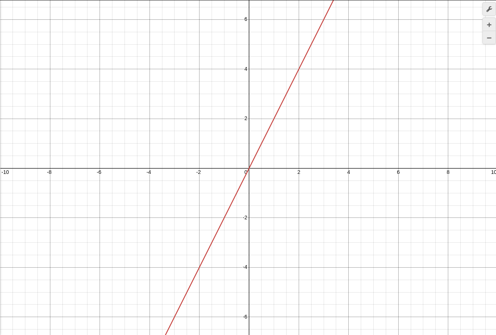

ответ на вопрос из 29 урока: этот График это Функция Прямой порпорциональности: то есть y = kx, то есть где y равен x умножонному на коэфициэнт(k),
то есть y = 33x как раз Функция Прямой порпорциональности. если x будет уменьшаться то и y будет уменьшатся,
пример: y = 0.1x. где x = 1 а y = 0.1. если x = -1 то и y = -0.1.
пример: y = (1/2)X Прямой порпорциональности
пример: y = 1/2X не Прямой порпорциональности
пример: y - 3x = 0 Прямой порпорциональности, ибо (y - 3x = 0) ү (y = 0 + 3x) = (y = 3x)
пример: y - x^2 = 2 не Прямой порпорциональности так как X^2 не подходит под "X" в уровнении y = kx, так как X може быть только в Первой Степени
теория: y - зависимая переменная, k - константа(коефициэнт или угол наклона), x - независимая переменная.
График в примере y = 2x, этот график: ПРЯМАЯ ЛИНИЯ! если взять график в интервале от -10 до +10 по оси X то График Будет Таким Же если от -100 до +100!

но на этот график если хоть точки будет в интервале от 0 до 4 с шагом 2, хоть в интервале от -4 до 0, и точки разные а график одинаков:
