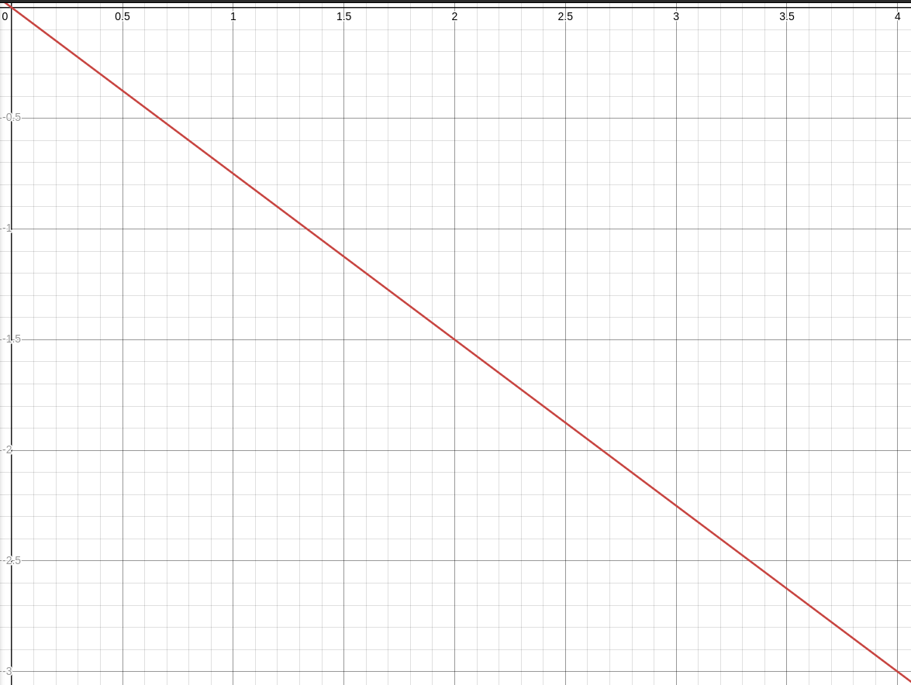
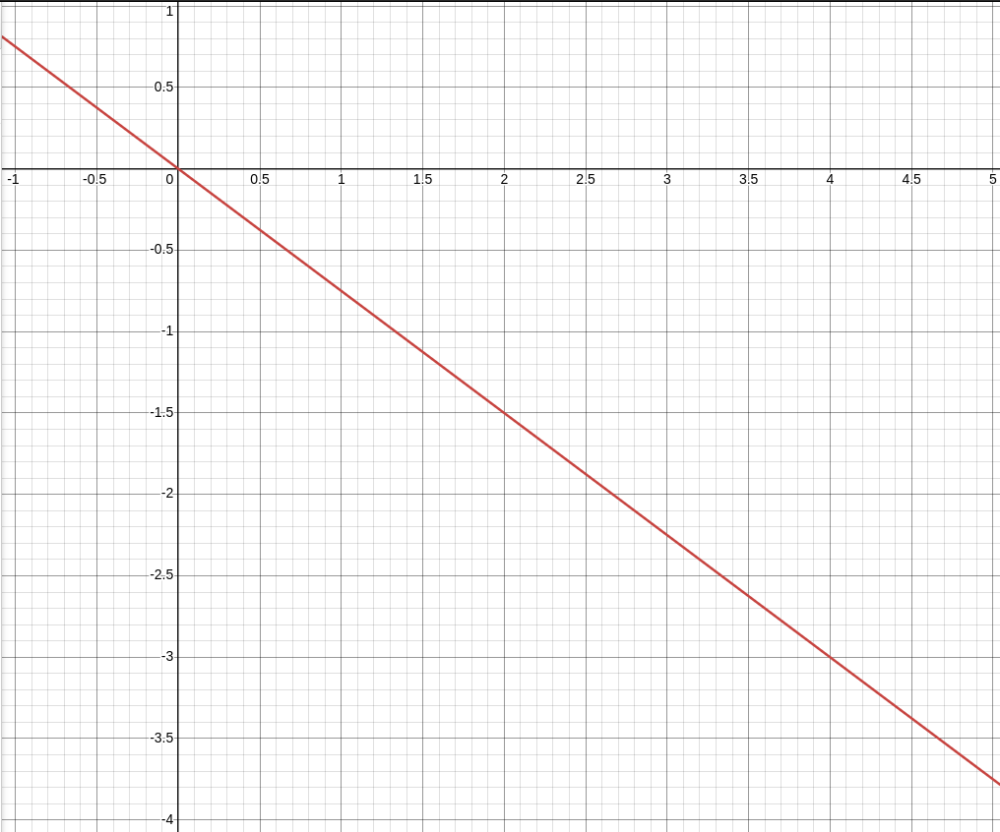
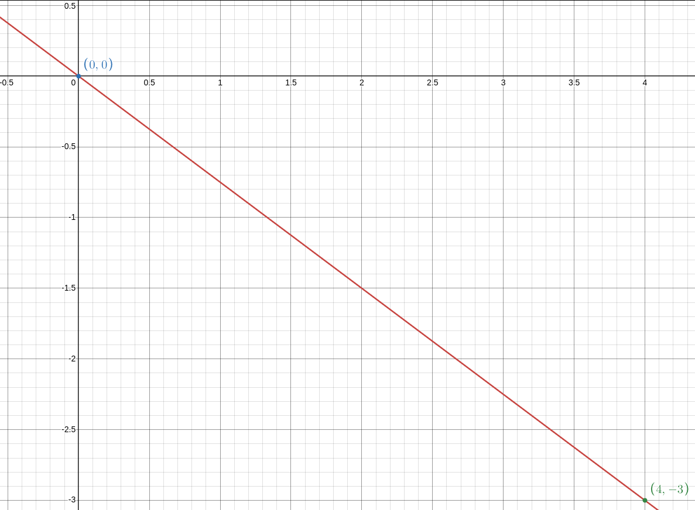
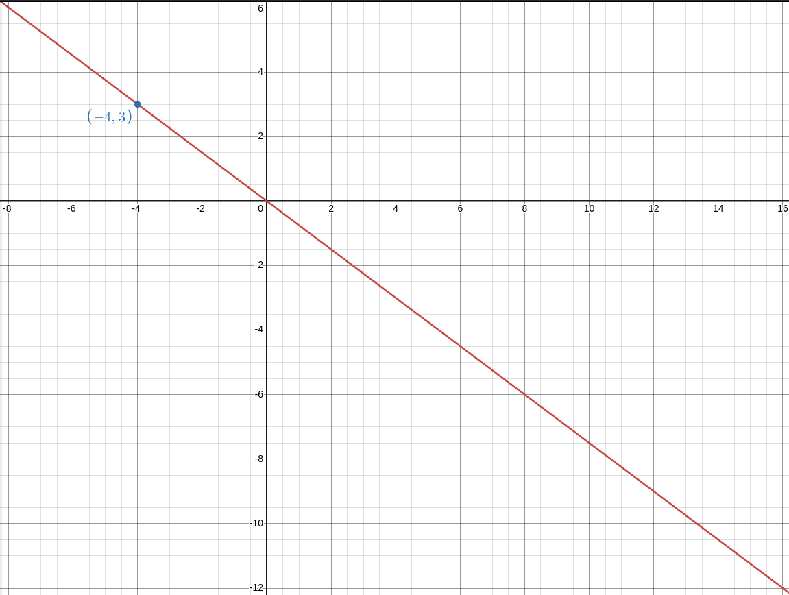
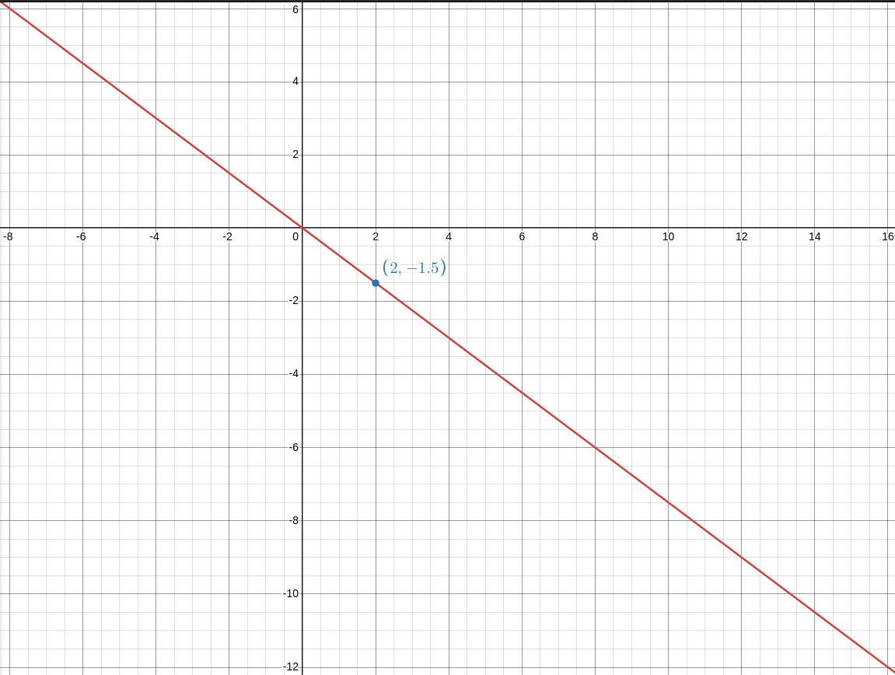
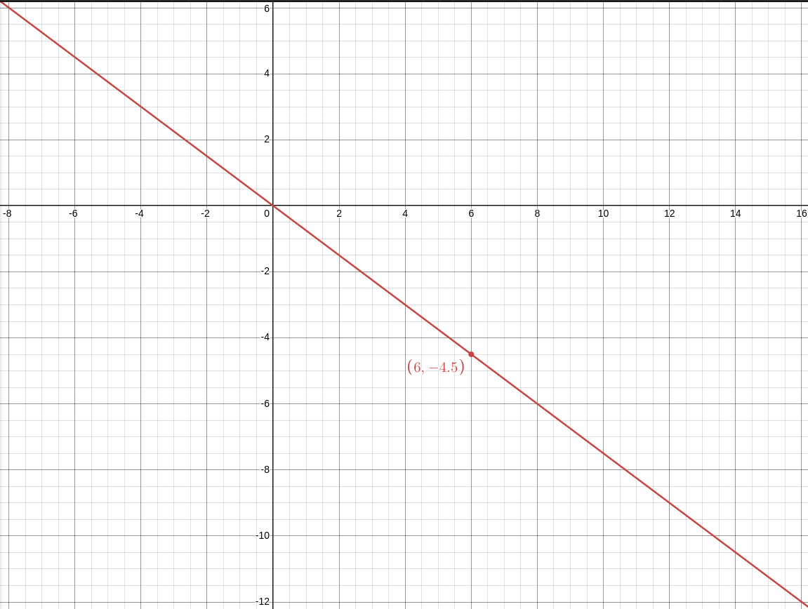
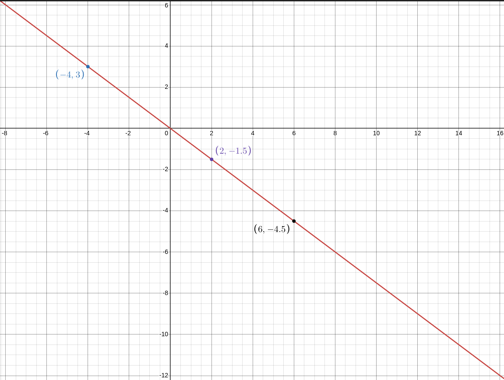

пример: y = (-3/4)X
график чаще всего рисуют между двумя точками:
таблица:
x | 0 | 4
y | 0 | -3
и график условно такой:

но это уже отрезок какой то... надо показать что это ПРЯМАЯ которая не заканчивается на интервале между 0 и 4

а так лучше...
а еще лучше обознчить точкиб как в таблице:

2. изпользуя график Прямой порпорциональности найти значение функции если аргумент равен -4,2,6

x = -4:

x = 2:

x = 6:

все вместе:

кслову! у нас k = -3/4 что МЕНЬШЕ чем 0! а потом...
