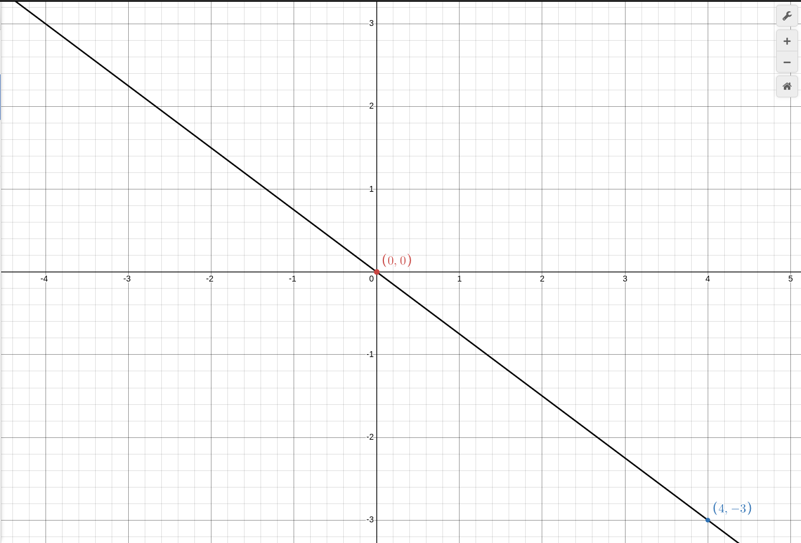
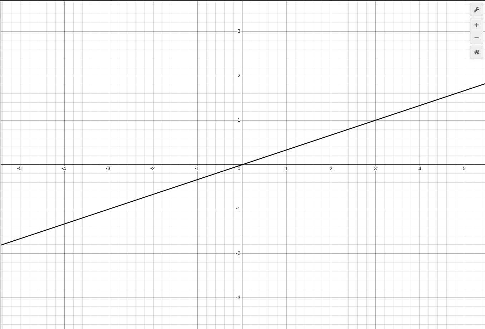
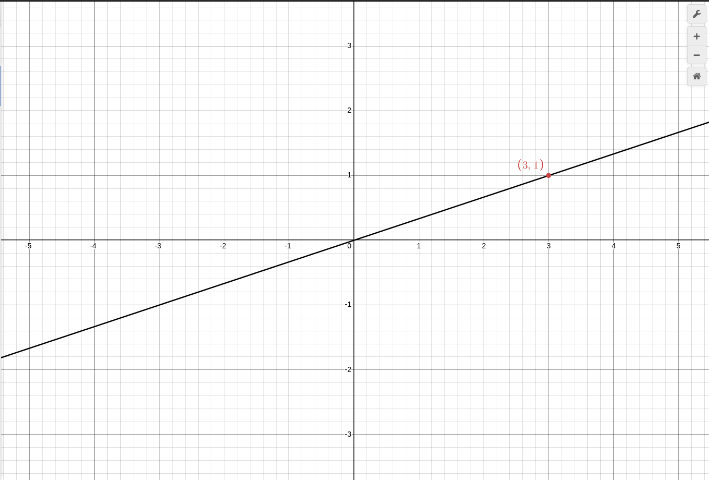

построим график y = (3/4)x:
и поставим две точки и еще запищем их в таблицу
| x | 0 | 4 |
| y | 0 | 3 |

далее мы понимаем что график тот же что и y

$$ y = -(3/4)x $$

но в отличии от того графика тут график не уменьшается а увеличивается а еще тот график проходит через II часть Координатной доски, а потом идет в IV а наш график идет из III в I!а все потому что наш k положительный, а k прошлый отрицательный!
а еще ВСЕ графики прямой порпорциональности проходит через точку (0,0).
а если он не положительный и не отрицательный а 0? то тогда просто :

$$ (y = kx) = (y = 0x) = (y = 0) $$

то есть вне зависимости от x, y будет равен нулю

итак график:

надо вычислить его формулу:

1. он проходит через Центр(0,0) - значит Функция Прямой Порпорциоцнальности - y = kx
2. находим "Удобную Точку" для никакие координаты по типу: 0.7,0.25667 не подходят, но в этой точке легко вычислить ее коордитаны:

3. далее зная что это точка 3 по x и 1 по y мы можем подсавить ее в y = kx: 1 = k3.
4. 1 = k3. что такое k? это Разумеется 1/3 ибо 1 = 1/3 × 3
5. обратно Постовляем так y = (1/3)X
