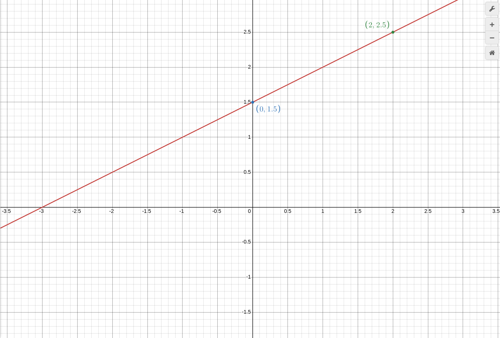

### Теория

y = kx это функция прямой порпорциональности,
y = kx + b это Линейная Функция
что такое b? то пересечение с осью oy!
определяем Линейность Фунции:
пример: (y = kx + b) = (y = 3x + (-2))
пример: (y = kx + b) = (y - x = 2) = (y = 1x + 2)
пример: (y = kx + b) ≠ (y^2 - xy = 2) ибо Квадраты не НУЖНЫ
пример: (y = kx + b) = (y+x/2 = 1) = (y+x/2 × 2 = 1 × 2) = (y+x = 2) = (y = 2 - x)

### Практика

мы Сделаем: (2y - x = 3) = (2y = 3 + x) = (y = 3/2 + (1/2)x)
теперь сторим график а перед этим таблицу
x | 0 | 2 |
y |1.5|2.5|

и кстате лучше записать формулу как y = (1/2)X + 3/2 потому что это выражение 1/2 подходит как k, а x под x, а 3/2 под b
обратим внимание на то что аша прямая прошла через точку (0,1.5) а не (0,0) а что такое 1.5? это 3/2! то есть b!
