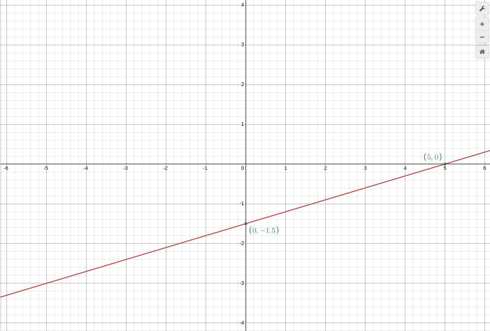

$$ y = 0.3x - 1.5 $$

таблица:
| x | 1 | 6
| y |-1.2|0.3
график(хочю напомнить что мы делаем Таблицу а потом ставим Точки а потом рисуем в тетради линию между ними. но я пишу Графики через desmos и таблица не нужна):

но сейчас мы будем искать точки пересечения у графика и осей `x` и `y`:

это графический способ нахождения пересечений: но проблема в том что в тетради можно не правильно нарисовать график! хорошо что есть DESMOS и 2 способ

итак 2 способ нахождения пересечений: дело в том что в точке пересечения с `x` на графике стоит коордитната (5,0) то есть 0 по оси `y`, а в точке пересечение с `y`(0,-1.5) то есть 0 по оси `x`.

пересечение с `y`: 0 по оси `x`
пересечение с `x`: 0 по оси `y`

теперь надо всеволишь подсавить 0 к формуле и получить ответ!

пересечение с `y`
(y = 0.3x - 1.5) = (y = - 1.5)
пересечение с `x`
(0 = 0.3x - 1.5) = (1.5 = 0.3x) = (x = 5)

не будем забывать ЧТО: y = 0.3x (- 1.5), -1.5 это точко пересечение с осью Y, по оси Y(по оси x мы знаем это 0)
