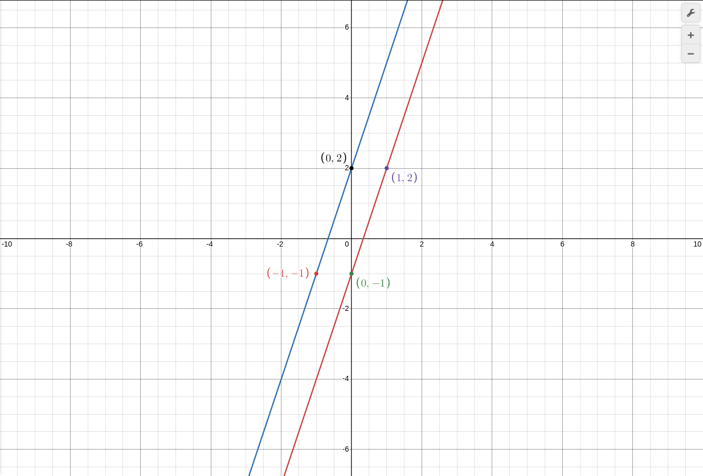
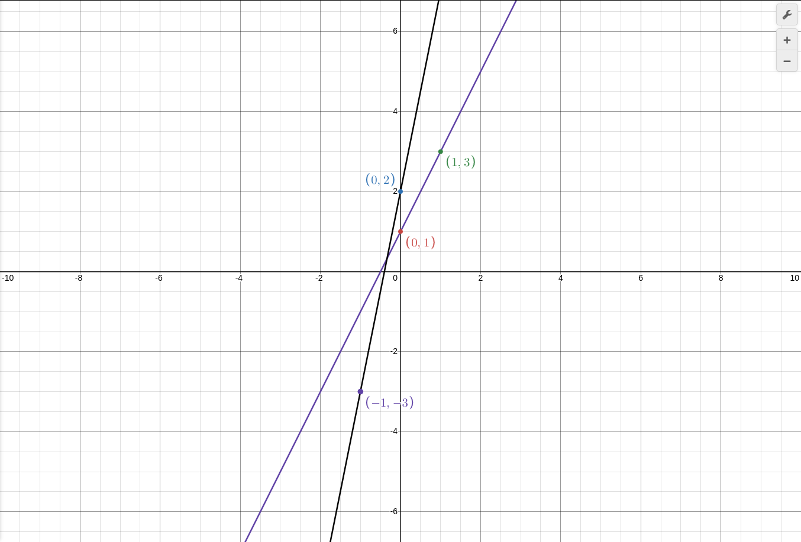

итак есть два вида: линии пересекутся, линии паралельные.
возьмем:
$$ y = 3x - 1 $$
таблица:
x | 0 | 1
y | -1| 2

$$ y = 3x + 2 $$
таблица:
x | 0 | -1
y | 2 | -1

графики:

видно что графики идут ПАРАЛЕЛЬНО, и видно что если линии продолжить Они Также будут идти паралельно и не пересекутся.а еще мы видим что и у первово и у второво выражение есть `k = 3`
соответсвенно: `k под номером 1 = k под номером 2`

### Второй

y = 2x + 1
таблица:
x | 0 | 1 |
y | 1 | 3 |

y = 5x + 2
таблица:
x | 0 | -1 |
y | 2 | -3 |

график:

и тут видно что графикик пересеклись ибо `k под номером 1 ≠ k под номером 2`

### Третий

Графики перпендикулярны: `если k под номером 1 = -(1/k под номером 2)`

пример: y = 5x - 1, надо написать выражение которое будет перпендекулярно этоу выражению
ответ: y = -0.25x + 16(разницы нету)

Швабия
Бавария
Саксония
Рейн
