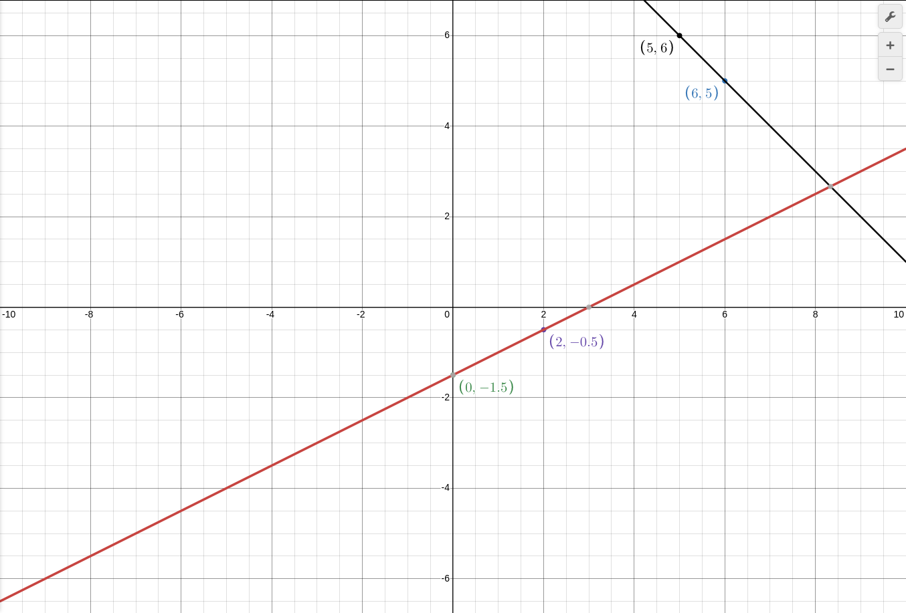

мы помним что такое система уровнение(Несколько связанных Выражений)
например:

$$ x + y = 11 $$
$$ x - 2y = 3 $$

так как мы решаем графическим способом надо превратить это в функцию:

$$ y = 11 - x $$
$$ y = 0.5x - 1.5 $$

в первом выражении мы понимаем что коефициэнт перед `x` равен -1, во втором равен 0.5 что не равно друг другу.

итак линии пересекутся. и таблица первово выражения:

x | 5 | 6 |
y | 6 | 5 |

второе вырожение, Таблица:

x | 0 | 2
y |-1.5|-0.5

график:

точка пересечения:

(8 и 1/3,2 и 2/3)

теперь понятно что графический способ не удобен, но факт:

$$ 8 + 1/3 + 2 + 2/3 = 11 $$

а ведь мы помним что у нас изначально было выражение:

$$ x + y = 11 $$

фактически мы подсавили как `x` 8 + 1/3. а как `y` 2 + 2/3

а другое выражение?

$$ x - 2y = 3 $$

подставим:

$$ 8(1/3) - 2 × 2(2/3) = 3 $$

получилось с обеями выражениями!
