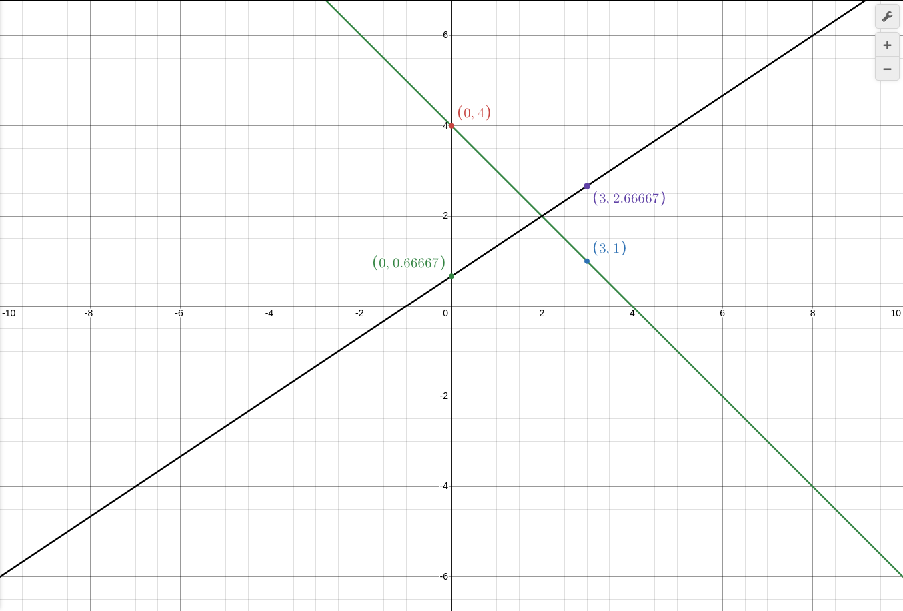

1. пример:

$$ x + y = 4 $$

$$ 2x - 3y = -2 $$

Шаг I:

$$ y = 4 - x $$

$$ 3y = 2x + 2 $$

Шаг II:

$$ y = 4 - x $$

$$ y = 2/3x + 2/3 $$

Шаг III: Сравнение `k`

начнем с того что в Первом выражении `k = 1` ибо перед x нету коэфициэнта,
а у второво выражения: `k = 2/3`
то есть прямые пересекутся

Шаг IV: Таблица

Первое Вырожение:

x | 0 | 3 |
y | 4 | 1 |

Второе Вырожение:

x | 0 | 3 |
y |2/3|8/3|

График:

а на этом графике Очень Легко Найти Точку пересечения (2,2)

и как мы помним если подставить точку пересечения под выражения, оба Должны Подойти!

Первое Вырожение:

$$ 2 = 4 - 2 $$

Второе Вырожение:

$$ 2 = 2/3 × 2 + 2/3 $$
