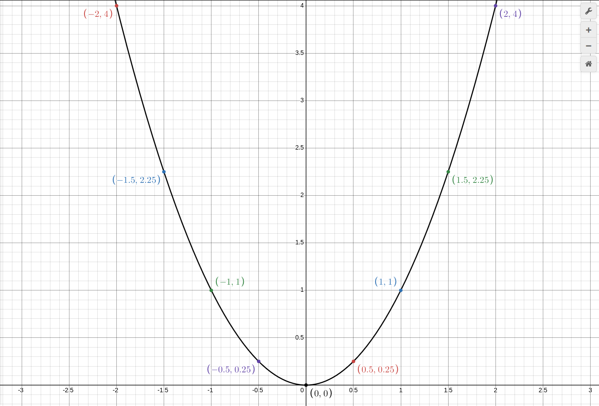

рассмотрим функции:

y = x^2
y = 3x^2
y = 0.5x^2

для того что бы посртоить Линейную Функцию надо поставит Две Точки ибо График Линейной Функции - Прямая.
Графики Данной Функции - Кривая.

вот Таблица при графике y = X^2:

| 1   | 2   | 3    | 4   | 5    | 6   | 7    | 8   | 9    | 10  |
| --- | --- | ---- | --- | ---- | --- | ---- | --- | ---- | --- |
| x   | -2  | -1.5 | -1  | -0.5 | 0   | 0.5  | 1   | 1.5  | 2   |
| y   | 4   | 2.25 | 1   | 0.25 | 0   | 0.25 | 1   | 2.25 | 4   |

и график:

