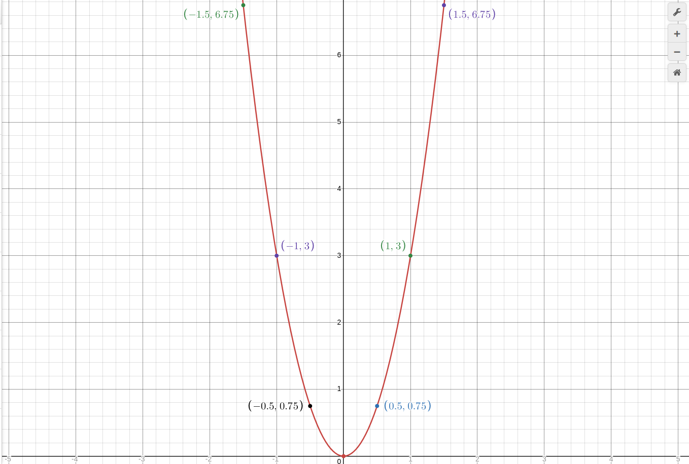
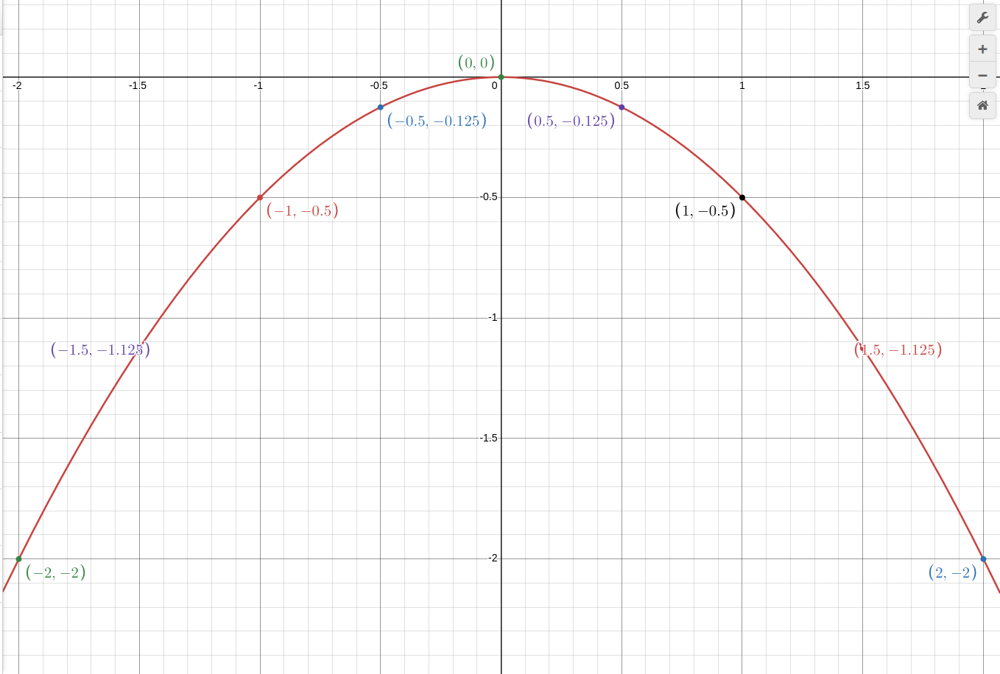

рассмотрим функцию: `y = ax^2` которая только отличается от преведущей функции наличием `a` коэфициэнта

1. пример: y = 3x^2

таблица:

| 1   | 2   | 3    | 4   | 5    | 6   | 7    | 8   | 9    | 10  |
| --- | --- | ---- | --- | ---- | --- | ---- | --- | ---- | --- |
| x   | -2  | -1.5 | -1  | -0.5 | 0   | 0.5  | 1   | 1.5  | 2   |
| y   | 12  | 6.75 | 3   | 0.75 | 0   | 0.75 | 3   | 6.75 | 12  |

график:

и этот график заметно Быстрее Падает и Взлетает(Угол Больше)

2. пример: y = -(1/2)x^2

таблица:

| 1   | 2   | 3      | 4    | 5      | 6   | 7      | 8    | 9      | 10  |
| --- | --- | ------ | ---- | ------ | --- | ------ | ---- | ------ | --- |
| x   | -2  | -1.5   | -1   | -0.5   | 0   | 0.5    | 1    | 1.5    | 2   |
| y   | -2  | -1.125 | -0.5 | -0.125 | 0   | -0.125 | -0.5 | -1.125 | -2  |

график:

3. вывод:

1) y = ax^2 всегда прозодят через точку (0,0)
2) a > 0 всегда ветви вверх
3) a < 0 всегда ветви вниз
4) если `a > 1` приближается к оси Y
5) если `0 < a < 1` то тогда приближается к оси X
