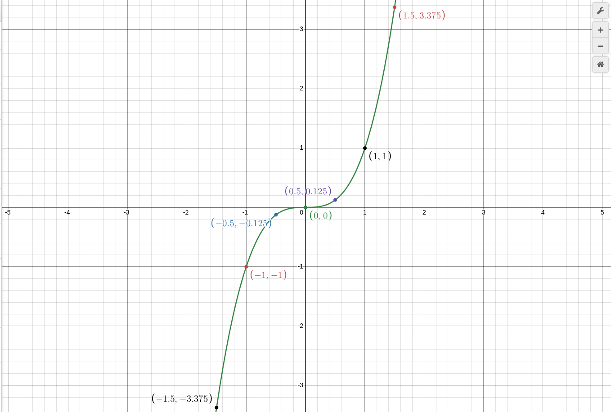
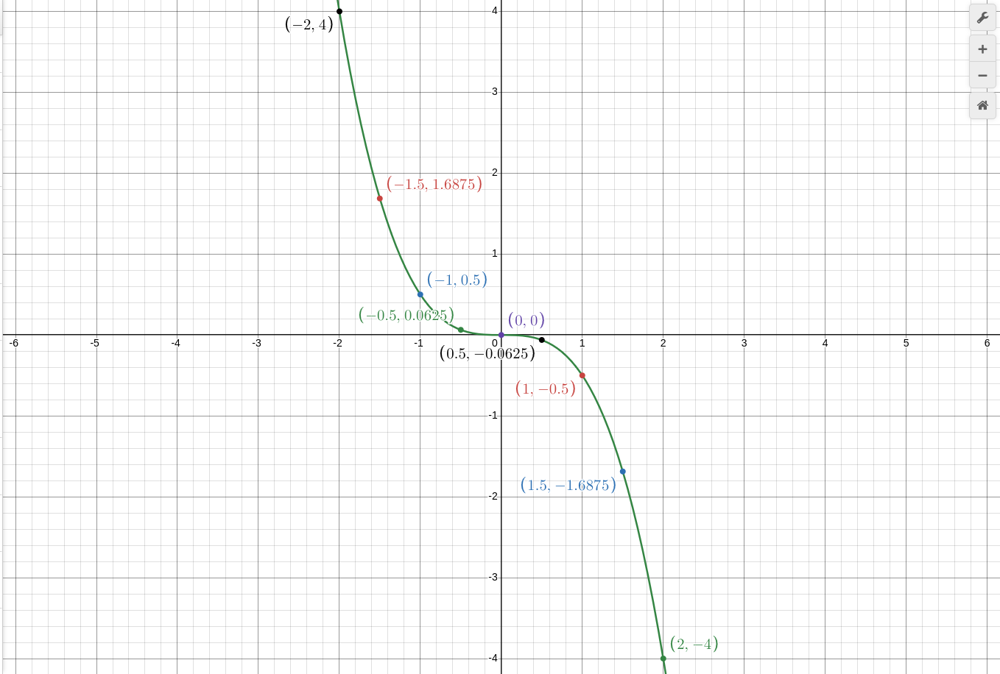

1. функция: `y = x^3`

таблица:

| 1   | 2   | 3      | 4   | 5      | 6   | 7     | 8   | 9     | 10  |
| --- | --- | ------ | --- | ------ | --- | ----- | --- | ----- | --- |
| x   | -2  | -1.5   | -1  | -0.5   | 0   | 0.5   | 1   | 1.5   | 2   |
| y   | -8  | -3.375 | -1  | -0.125 | 0   | 0.125 | 1   | 3.375 | 8   |

график:

и мы видим что график в отличии от `x^2` тут график идет снизу вверх через разумеется (0,0). это называется `КУБИЧЕСКАЯ ПАРАБУЛА`

`y = x^3` частный случай `y = ax^3`

2. пример: `y = -(1/2)x^3`

таблица:

| 1   | 2   | 3      | 4   | 5    | 6   | 7     | 8    | 9       | 10  |
| --- | --- | ------ | --- | ---- | --- | ----- | ---- | ------- | --- |
| x   | -2  | -1.5   | -1  | -0.5 | 0   | 0.5   | 1    | 1.5     | 2   |
| y   | 4   | 1.6875 | 0.5 | 1/16 | 0   | -1/16 | -0.5 | -1.6875 | -4  |

график:

вывод при отрицательном `a` график идет вниз, при положительном вверх.а еще второй график(`a = -1/2`) идет дальше от оси Y, чем первый
