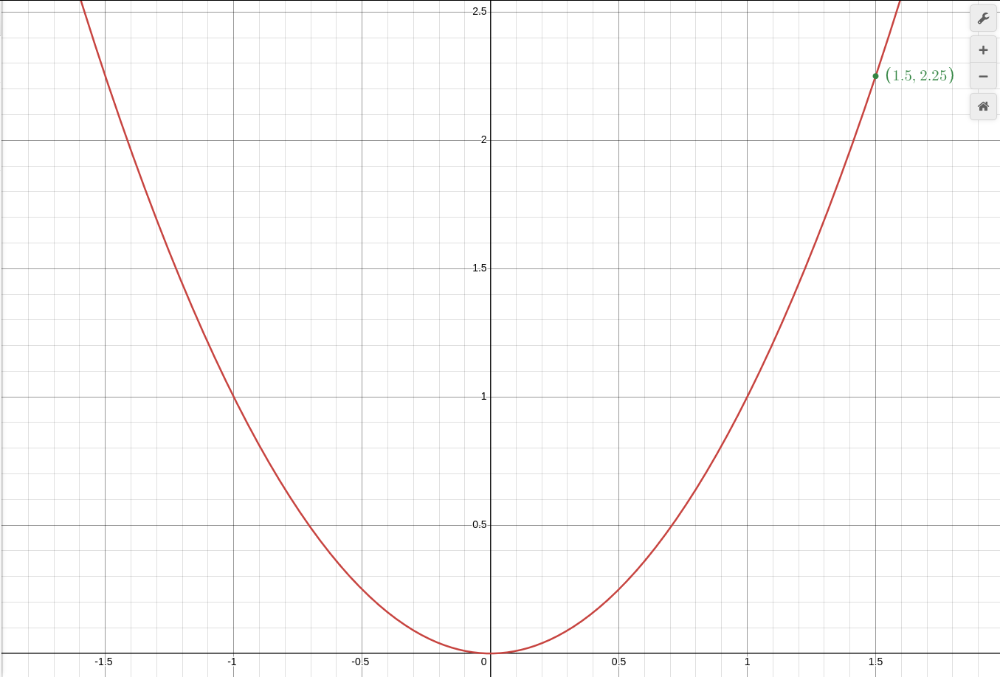
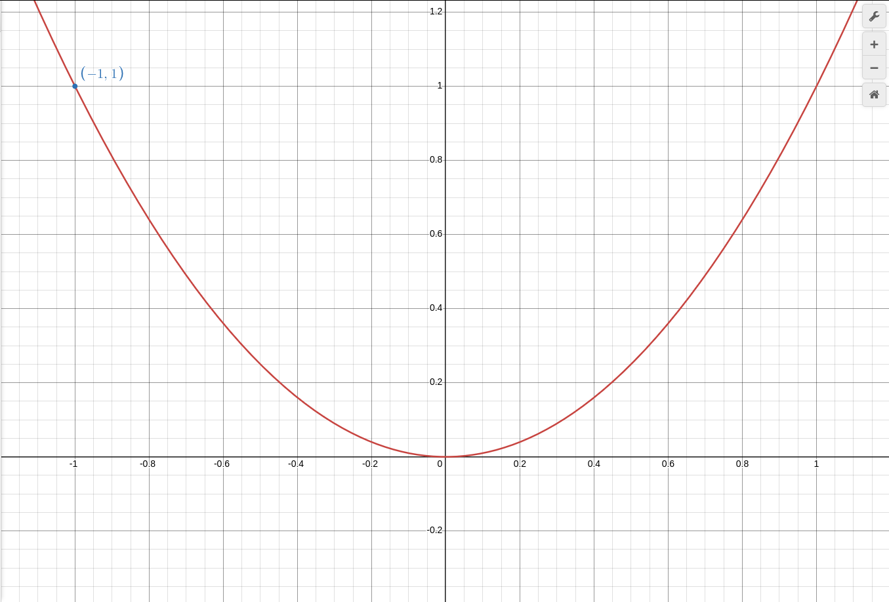
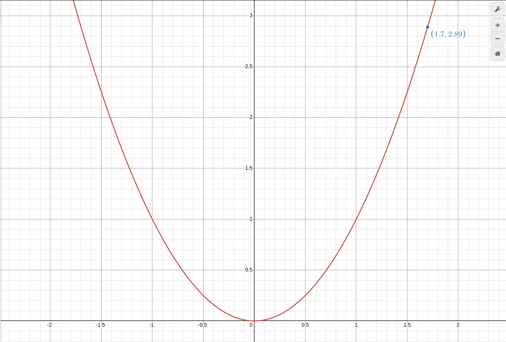
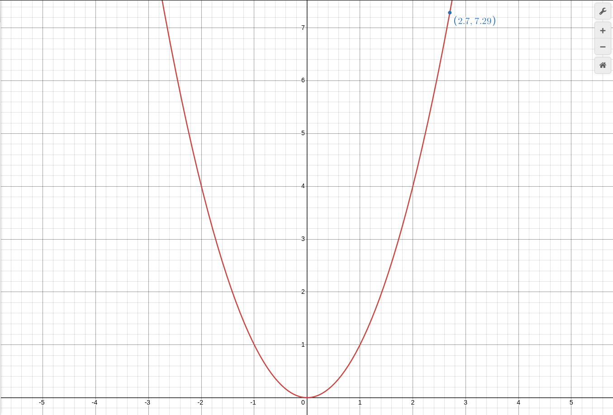
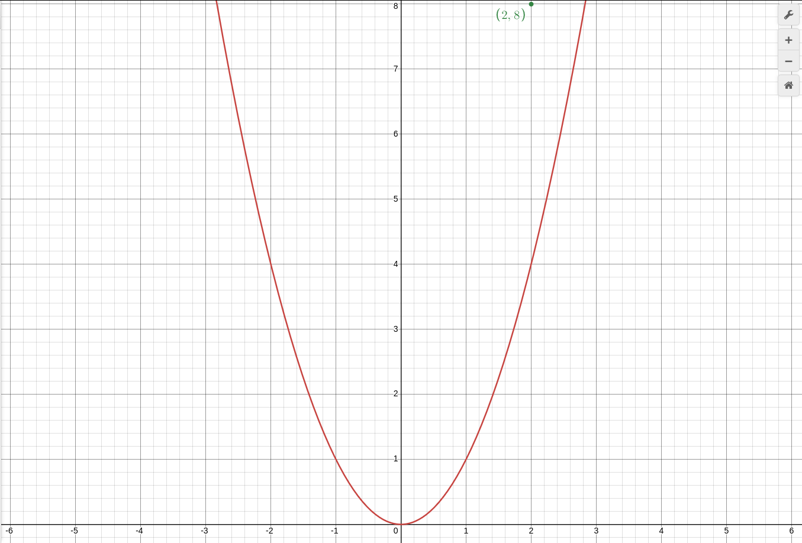
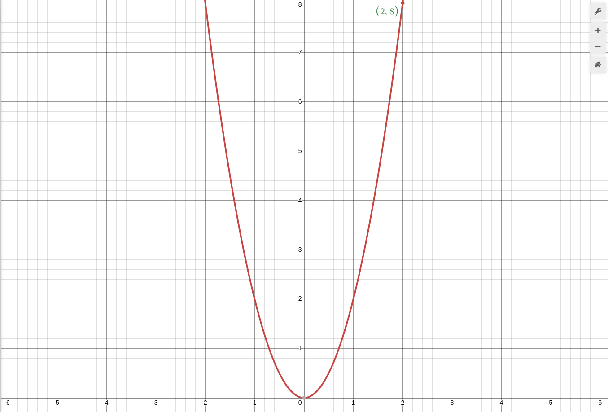

### Функция y = x^2

1. найти значение функции если значение аргумента = `1.5`,`-1`,`1.7`,`2.7`. найти графиком(но когда нельзя мождо подставить x в формулу нашей функции)!

точка номер 1(`y = 1.5^2`):

точка номер 2(`y = -1^2`):

точка номер 3(`y = 1.7^2`):

точка номер 4(`y = 2.7^2`):

2. найти x если y = 2. напомню при `y = x^2`, выражение ` найти x если y = 2` озночает `Квадратный Корень из 2`. однако извесно что `Квадратный Корень из 2` как и число PI это Бесконечная Дробь.

однако надо понять: если напустим `1.4^2` это всегда `1.96`, то `Квадратный Корень из 4` например дает 2 варианта `2`,`-2`.

вывод: Степень Только 1 ответ, `Квадратный Корень` всегда 2 ответа.

3. точка `B` с координатами (2,8) принадлежит графику функции `y = ax^2`, итак чему равен `a(в выражении - ax^2)`?

и тут возьмем график `y = x^2`

видно что точка ближе к линии `y`, а как мы помним чем больше `a: коэфициэнт` чем ближе линия к оси `y`

и подбираем `y = 2x^2`

и я угодал! действительно точка лежит на графике!

но есть и другой вариант того как можно было узнать что `a = 2`: Подстовляем!

$$ 8 = a2^2 $$

тут понятно что:

$$ 8 = 4a $$

и `a = 2`.

3. точка `B` с координатами (-3,`C`) принадлежит графику функции `y = 1/2x^2`, итак чему равен `C`?

тут графический способ не приминить(или сложно), поэтому ПОДСТОВЛЯЕМ!

`C = 1/2 × -3^2` и тут получаем `C = 1/2 × -3^2` соответственно: `C = 4.5`
